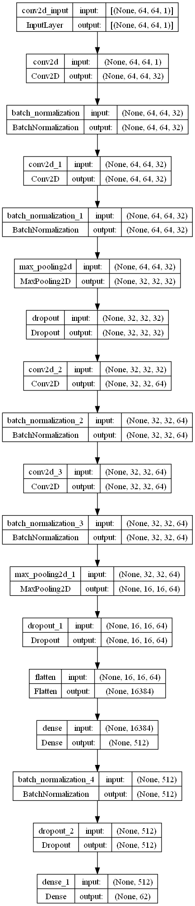

# Handwriting to Text - Machine Learning

<!--  -->

  

<!--   -->

### Presentation
https://docs.google.com/presentation/d/1oVR_5n-sLKSudW5DLdqL-vmx-4vkkrL3hRPnvSN9e4k/edit#slide=id.gdcb566e1d5_0_62

### Contributors
* Sean Evans <https://www.linkedin.com/in/sean-evans/>

## Business Understanding
We were tasked with building a Neural Network model for the purposes of recognizing handwritten letters/number and converting them to text. 

## Business Applications
1. The post office - helping to identify the handwritten addresses on mail items
2. Converting historical medical records over to text files for record keeping and future meta-analysis
3. Historical Censes and government records for record keeping and future meta-analysis
4. Handwriting software for taken handwritten notes and converting them to a text file of notes

## Training Data
https://www.kaggle.com/datasets/dhruvildave/english-handwritten-characters-dataset

- Image LocationL Img/.png files (3410 files)
  - Images Details: img00#-00#.png, Width: 1200px, Height: 900px
- Labels File: labels/english.csv (71.62 kB)

## Helper Function and Reasoning
- Loading Function: This function takes the folder containing the images and the file with each images corresponding 'target' label. It loads the images from the location, converts them to grayscale, resizes them to a size of 64x64 pixels, and appends them to the images list with their label. Returning the images and labels lists. 
  - Uses LabelEncoder to convert categorical labels into numerical labels.
  - (images - mean) / std: Normalizes the pixel values of the images array by subtracting the mean and dividing by the standard deviation. 
  * This normalization step is commonly performed in machine learning to ensure that the input data has a similar scale, which can improve the performance of models.
  - encoded_labels = to_categorical(numerical_labels): This line applies the to_categorical function to the numerical_labels array. This converts the numerical labels into a one-hot encoded representation, which is a binary vector where each element corresponds to a unique label and has a value of 1 if the sample belongs to that class, and 0 otherwise.

- The code loads images from a specified folder, preprocesses them by converting to grayscale, resizing, and normalizing the pixel values. It also encodes the labels into numerical and one-hot encoded representations, preparing the data for further machine learning.

## Data Augmentation
- train_test_split: Randomly splits data leaving 20% for later testing. random_state set to 42 for reproducibility
- ImageDataGenerator from the Keras library;
  - rotation_range=35: Rotating images randomly by 35% degrees. Limiting at 35% degrees so that a number or letter does not end up looking like a different number/letter. For example, an upside down 6 is a 9.
  - width_shift_range=0.1:  Shifts images horizontally by 10% of the width
  - height_shift_range=0.1: Shifts images vertically by 10% of the height
  - shear_range=0.0: Plan to look into shear more as some can replicate handwritting styles but too much could create something outside normal handwriting styles.
  - zoom_range=0.1: Applying a zoom transformation with a zoom range of 10%
  - horizontal_flip=False: Passed on applying horizontal flip for reasons mentionend in 'rotation_range'
  - vertical_flip=False: Passed on applying vertical flip for reasons mentionend in 'rotation_range'
# 

  

## Model Description

### Convolutional and pooling layers:
First uses two blocks of Conv2D layers followed by a BatchNormalization layer, a MaxPooling2D layer, and a Dropout layer.
Conv2D layers are extracting features from the input images by sliding a convolution filter over the input to produce a feature map. This starts with 32 filters on the first block with a size of 3x3. The number of filters is doubled to 64 on the second block.
The BatchNormalization layers are used to accelerate the learning speed and stabilize the training process. By normalizing the input layer via adjusting and scaling the activations, each layer of a network can learn by itself and act a little more independently of the other layers.
The MaxPooling2D layers are used to reduce the spatial dimensions (width, height) of the input image for the next convolutional layer in the network. A pool size of 2x2 is used to down sample the input by half its width and height.
Dropout layers are used as a type of regularization to prevent overfitting. These will randomly sets a fraction of input units to 0 during training. This helps to prevent overfitting and reduces the overreliance on a single learned feature. A dropout rate of 10% is used here.

### Fully connected layers:
After the convolutional/pooling layers, the model flattens the tensor output into a vector to prepare it for the fully connected layer.
The first Dense layer has 512 units with the ReLU activation function.
This is followed by another BatchNormalization layer and a Dropout layer, with the same dropout rate of 10% as was used before.
The final Dense layer has a number of units equal to the number of classes (len(le.classes_)), and uses a softmax activation function for a multi-class classification problem.

### Architecture
The architecture of this Convolutional Neural Network (CNN) Model, with two blocks of Conv2D, BatchNormalization, and MaxPooling2D layers, followed by two Dense layers, is a common choice and is similar to and influenced by the design of early successful Convolutional Neural Networks such as the LeNet-5, AlexNet, VGGNet. The common pattern followed by these networks is a series of convolutional layers followed by pooling layers, and finally one or more fully connected layers.

-	LeNet-5: This is one of the earliest convolutional neural networks. It was primarily used for digit recognition tasks such as reading zip.

-	AlexNet: Was used in the ImageNet Large-Scale Visual Recognition Challenge in 2012. It significantly outperformed all the prior competitors and brought a breakthrough in the field of Computer Vision.

-	VGGNet: Was the runner-up in ILSVRC 2014. Its main contribution was in showing that the depth of the network (number of layers) is a critical component for good performance.

Other architectures have been proposed that build on these common structures adding additional components, such as skip connections (ResNet), inception modules (InceptionNet), and depthwise separable convolutions (MobileNet). However, the basic structure of convolutional layers followed by pooling layers and ending in fully connected layers remains a staple in the field of Convolutional Neural Networks.

### Image of Model Architecture 

  

## Python and module versions
- Python: 3.10.11 | packaged by Anaconda, Inc. |
  - babel==2.11.0
  - bottleneck==1.3.5
  - jinja2==3.1.2
  - keras-preprocessing==1.1.2
  - markdown==3.4.1
  - markupsafe==2.1.1
  - pillow==9.4.0
  - pyjwt==2.4.0
  - pyqt5==5.15.7
  - pyqt5-sip==12.11.0
  - pysocks==1.7.1
  - pyyaml==6.0
  - pygments==2.15.1
  - qtpy==2.2.0
  - send2trash==1.8.0
  - werkzeug==2.2.3
  - absl-py==1.4.0
  - afinn==0.1
  - aiofiles==22.1.0
  - aiohttp==3.8.3
  - aiosignal==1.2.0
  - aiosqlite==0.18.0
  - anyio==3.5.0
  - appdirs==1.4.4
  - argon2-cffi==21.3.0
  - argon2-cffi-bindings==21.2.0
  - asttokens==2.0.5
  - astunparse==1.6.3
  - async-timeout==4.0.2
  - attrs==22.1.0
  - backcall==0.2.0
  - beautifulsoup4==4.12.2
  - bleach==4.1.0
  - blinker==1.4
  - brotlipy==0.7.0
  - cachetools==4.2.2
  - certifi==2023.5.7
  - cffi==1.15.1
  - charset-normalizer==2.0.4
  - click==8.0.4
  - cloudpickle==2.2.1
  - colorama==0.4.6
  - comm==0.1.2
  - contourpy==1.0.5
  - cryptography==39.0.1
  - cycler==0.11.0
  - debugpy==1.5.1
  - decorator==5.1.1
  - defusedxml==0.7.1
  - entrypoints==0.4
  - executing==0.8.3
  - fastjsonschema==2.16.2
  - filelock==3.9.0
  - flatbuffers==2.0
  - fonttools==4.25.0
  - frozenlist==1.3.3
  - future==0.18.3
  - gast==0.4.0
  - google-auth==2.6.0
  - google-auth-oauthlib==0.4.4
  - google-pasta==0.2.0
  - grpcio==1.48.2
  - h5py==3.7.0
  - hyperopt==0.2.7
  - idna==3.4
  - imbalanced-learn==0.10.1
  - ipykernel==6.19.2
  - ipython==8.12.0
  - ipython-genutils==0.2.0
  - ipywidgets==8.0.4
  - jedi==0.18.1
  - joblib==1.2.0
  - json5==0.9.6
  - jsonschema==4.17.3
  - jupyter==1.0.0
  - jupyter-client==8.1.0
  - jupyter-console==6.6.3
  - jupyter-core==5.3.0
  - jupyter-events==0.6.3
  - jupyter-server==2.5.0
  - jupyter-server-fileid==0.9.0
  - jupyter-server-terminals==0.4.4
  - jupyter-server-ydoc==0.8.0
  - jupyter-ydoc==0.2.4
  - jupyterlab==3.6.3
  - jupyterlab-pygments==0.1.2
  - jupyterlab-server==2.22.0
  - jupyterlab-widgets==3.0.5
  - keras==2.10.0
  - keras-tuner==1.3.5
  - kiwisolver==1.4.4
  - kt-legacy==1.0.5
  - lxml==4.9.2
  - matplotlib==3.7.1
  - matplotlib-inline==0.1.6
  - mistune==0.8.4
  - mkl-fft==1.3.6
  - mkl-random==1.2.2
  - mkl-service==2.4.0
  - mpmath==1.2.1
  - multidict==6.0.2
  - munkres==1.1.4
  - nbclassic==0.5.5
  - nbclient==0.5.13
  - nbconvert==6.5.4
  - nbformat==5.7.0
  - nest-asyncio==1.5.6
  - networkx==3.1
  - nltk==3.7
  - notebook==6.5.4
  - notebook-shim==0.2.2
  - numexpr==2.8.4
  - numpy==1.24.3
  - oauthlib==3.2.2
  - opencv-python==4.7.0.72
  - opt-einsum==3.3.0
  - packaging==23.0
  - pandas==1.5.3
  - pandocfilters==1.5.0
  - parso==0.8.3
  - pickleshare==0.7.5
  - pip==23.1.2
  - platformdirs==2.5.2
  - ply==3.11
  - pooch==1.4.0
  - prometheus-client==0.14.1
  - prompt-toolkit==3.0.36
  - protobuf==3.20.3
  - psutil==5.9.0
  - pure-eval==0.2.2
  - py4j==0.10.9.7
  - pyopenssl==23.0.0
  - pyaml==23.5.9
  - pyasn1==0.4.8
  - pyasn1-modules==0.2.8
  - pycparser==2.21
  - pydot==1.4.2
  - pyparsing==3.0.9
  - pyrsistent==0.18.0
  - python-dateutil==2.8.2
  - python-json-logger==2.0.7
  - pytz==2022.7
  - pywin32==305.1
  - pywinpty==2.0.10
  - pyzmq==25.1.0
  - qtconsole==5.4.2
  - regex==2022.7.9
  - requests==2.29.0
  - requests-oauthlib==1.3.0
  - rfc3339-validator==0.1.4
  - rfc3986-validator==0.1.1
  - rsa==4.7.2
  - scikit-learn==1.2.2
  - scikit-optimize==0.9.0
  - scipy==1.10.1
  - seaborn==0.12.2
  - setuptools==67.8.0
  - sip==6.6.2
  - six==1.16.0
  - sniffio==1.2.0
  - soupsieve==2.4
  - stack-data==0.2.0
  - sympy==1.11.1
  - tensorboard==2.10.0
  - tensorboard-data-server==0.6.1
  - tensorboard-plugin-wit==1.8.1
  - tensorflow==2.10.0
  - tensorflow-estimator==2.10.0
  - termcolor==2.1.0
  - terminado==0.17.1
  - tf-explain==0.3.1
  - threadpoolctl==2.2.0
  - tinycss2==1.2.1
  - toml==0.10.2
  - tomli==2.0.1
  - torch==2.0.1+cu118
  - torchaudio==2.0.2+cu118
  - torchvision==0.15.2+cu118
  - tornado==6.2
  - tqdm==4.65.0
  - traitlets==5.7.1
  - typing-extensions==4.6.3
  - urllib3==1.26.16
  - wcwidth==0.2.5
  - webencodings==0.5.1
  - websocket-client==0.58.0
  - wheel==0.38.4
  - widgetsnbextension==4.0.5
  - win-inet-pton==1.1.0
  - wordcloud==1.9.2
  - wrapt==1.14.1
  - xgboost==1.7.6
  - y-py==0.5.9
  - yarl==1.8.1
  - ypy-websocket==0.8.2

# 
# 
# 

  

  

